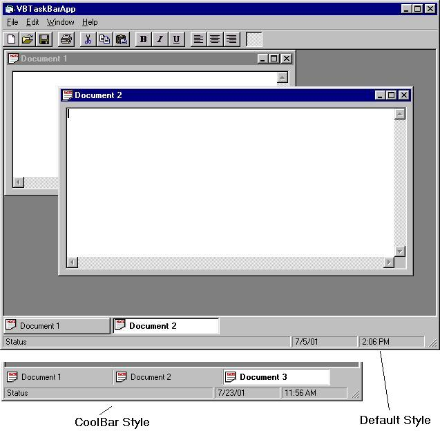



## UPDATED:  MDI Task Bar control 1\.6

### Description

*UPDATE 1.6*

Added the AutoHide features that people have been requesting.

The control now has 4 properties that are for the AutoHide feature:

1. AutoHide, Boolean

This tells the bar to hide when the mouse is no longer over it.

2. AutoHideWait, Integer

This tells the bar how long to wait before hiding (in case you accidentally move the mouse off of it, it wont immediately hide)

It is in Milliseconds so 1000 = 1 second.

3. AutoHideAnimate, Boolean

This tells the bar to "slide" off screen instead of just disappearing.

4. AutoHideAnimateFrames, Integer

This is the # of frames to split the "Slide" effect into (more frames is slower, but smoother)

I recommend 50 - 100 frames. From my testing it seems to be the best.

*UPDATE 1.5*

Fixed the icon drawing problems when comipled on windows 2000.

Re-wrote a lot of code to optimize for speed, and to make the code easier to read/understand.

Added a lot more and better comments.

*UPDATE 1.4* Fixed the drawing on windows 2000/nt/95.

Fixed the bar to work when used with a compiled exe.

Fixed some drawing problems with the coolbar style.

*UPDATE 1.3* Fixed one more windows 2000 bug. still having the compiled issue on win2k.

Added a new style (now you can select the style property), Coolbar.

*UPDATE 1.2* fixed the win2k bug. Now works perfectly in windows 2000.

ADDED: Color settings, for every button state, and for the bar itself.

Fixed many bugs (none left that I know of)

Added the menu. Now when you right click on

a button on the task bar, it shows the system

menu from the form that the button belongs to.

This ia fully working Taskbar for an MDI form. Works just like the windows task bar. It was originally written by Maxx Zephyr Technology and uploaded to www.freevbcode.com. That version had problems, and also was not a stand alone control, it had to be included in your project because it was dependant on the Forms collection. I went through the code, cleaned it up, removed the forms collection (used the api to replace it) and made the user control into a full stand alone ocx, that you can simply drop on an MDI form.
 
### More Info
 

             |
---                |---
**Submitted On**   |2001-07-25 15:42:06
**By**             |[Gregg Housh](https://github.com/Planet-Source-Code/PSCIndex/blob/master/ByAuthor/gregg-housh.md)
**Level**          |Intermediate
**User Rating**    |4.6 (73 globes from 16 users)
**Compatibility**  |VB 6\.0
**Category**       |[Custom Controls/ Forms/  Menus](https://github.com/Planet-Source-Code/PSCIndex/blob/master/ByCategory/custom-controls-forms-menus__1-4.md)
**World**          |[Visual Basic](https://github.com/Planet-Source-Code/PSCIndex/blob/master/ByWorld/visual-basic.md)
**Archive File**   |[UPDATED\_  235037252001\.zip](https://github.com/Planet-Source-Code/gregg-housh-updated-mdi-task-bar-control-1-6__1-24861/archive/master.zip)

